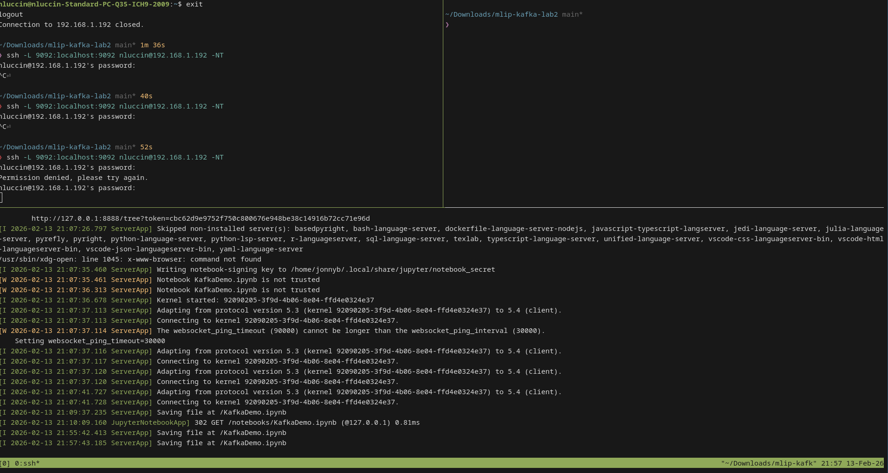
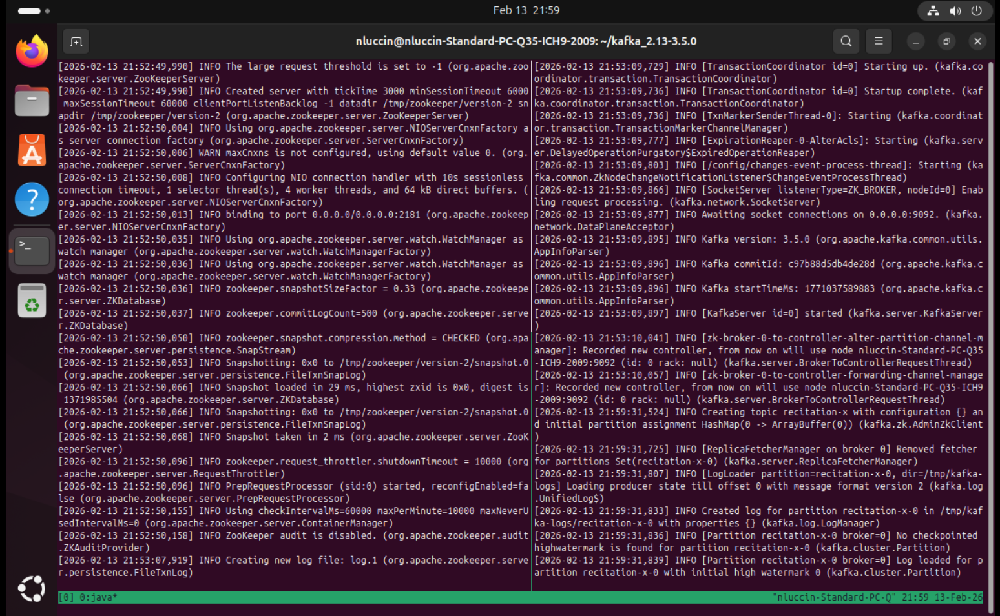
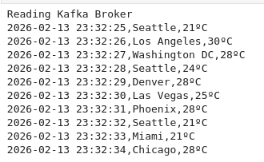
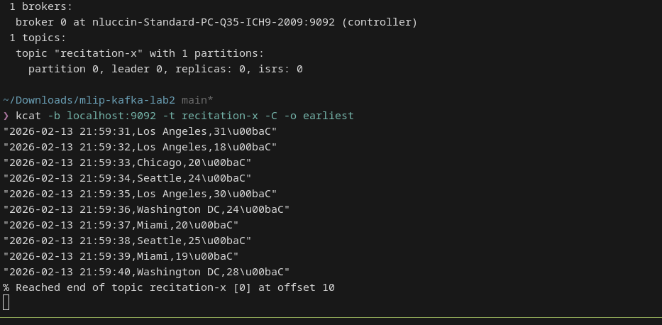

# 📦 Kafka + Docker Producer/Consumer Lab

## Overview

In this hands-on lab, you will work with **Apache Kafka**, a distributed streaming platform for large-scale, real-time data, and gain exposure to **Docker containers**.

You will:

- Use Docker to pull and run a local Kafka instance
- Establish a secure connection to a Kafka broker
- Produce and consume messages using Python
- Explore Kafka command-line tools (`kcat`) for inspection and monitoring

This lab prepares you for the upcoming **Kafka Streams group project**.  
The notebook `KafkaDemo.ipynb` provides a step-by-step guide for Python interactions.

---

## 🎯 Learning Objectives

By the end of this lab, you will be able to:

- Explain **topics** and **offsets** and how they enable message continuity after consumer disconnects
- Configure and run a Python producer and consumer against a Kafka broker
- Use `kcat` (or an equivalent CLI) to inspect, manage, and monitor topics and messages

---

## ✅ Deliverables

### Connection Setup

If you deployed Kafka on a remote server, cloud cluster, or managed service, provide:

- SSH tunnel command used
- Brief explanation
- Screenshot showing an active tunnel

---

### Python Producer & Consumer

Implement producer and consumer modes by modifying the starter code.

Include:

- Final Python scripts/notebook cells
- Sample output showing:
  - Successful message production
  - Successful consumption
  - Offsets displayed

---

### kcat (CLI) Demonstration

Show topic/message management and monitoring using `kcat` (or approved alternative).

Include:

- Commands executed
- Screenshots or captured output
- Examples:
  - Create topic
  - List topics
  - Describe topic
  - Read from beginning

---

## 🚀 Getting Started

### 1️⃣ Clone the Starter Repository

```bash
git clone <REPO_LINK>
cd <repo>
```

The repository includes a Python notebook demonstrating Kafka producer and consumer patterns.

---

### ⚠️ kafka-python Compatibility Fix

If you encounter issues:

```bash
pip uninstall -y kafka-python
pip install kafka-python-ng
```

---

### 2️⃣ Environment & Dependencies

Python **3.9+ recommended**

Optional virtual environment:

```bash
python -m venv venv
source venv/bin/activate      # macOS/Linux
venv\Scripts\activate         # Windows
```

Install dependencies:

```bash
pip install -r requirements.txt
```

---

## 🔐 Connecting to Remote Kafka (SSH Tunnel)

> Not needed if running a local Docker Kafka broker.

```bash
ssh -L <local_port>:localhost:<remote_port> <user>@<remote_server> -NTf
```

Keep the tunnel open while running producer/consumer.

Test connectivity:

```bash
kcat -b localhost:<local_port> -L
```

---

## 🧪 Implementing Producer–Consumer Mode

Follow the TODO blocks in the starter scripts/notebook.

---

### Producer Mode — Write Data





---

### Consumer Mode — Read Data



---

## 🧠 Concepts to Explain

**Topic** — Named stream of records split into partitions  
**Offset** — Monotonically increasing position within a partition  
**Continuity** — Consumers resume from last committed offset after restart
**Group ID** — us-cities

---

## 🛠 Using Kafka CLI Tools — kcat





---

## ✅ Validation Checklist

- Broker reachable → `kcat -L` shows metadata
- Producer works → messages visible from beginning
- Consumer continuity verified after restart

---

## 🐛 Troubleshooting

**Connection refused**
- Check SSH tunnel
- Verify ports

**Auth/version errors**
- Check compatibility

**No messages**
- Check topic name
- Use `-o beginning`

**Windows CLI issues**
- Use Linux/macOS or pair up

---

## 📚 Additional Resources

- [Apache Kafka](https://kafka.apache.org/)
- [Kafka for Beginners](https://developer.confluent.io/learn-kafka/)
- [What is Apache Kafka — TIBCO](https://www.tibco.com/reference-center/what-is-apache-kafka)
- Kafka Intro Video 1 *(5-min quick intro)*
- Kafka Intro Video 2
- Docker Installation and Local Kafka Guide (PDF)

---
